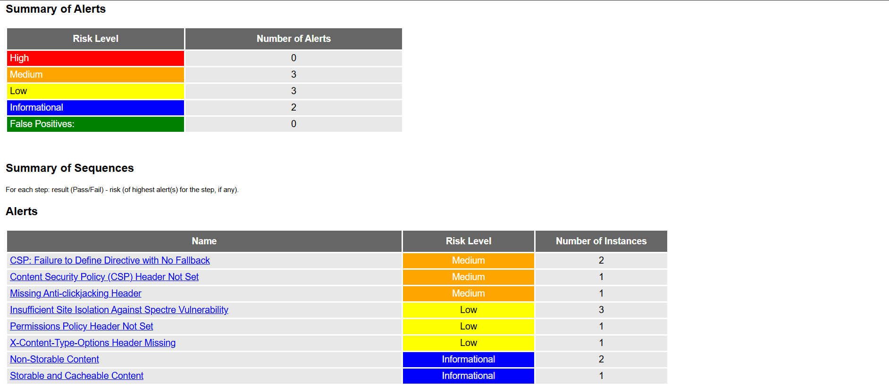
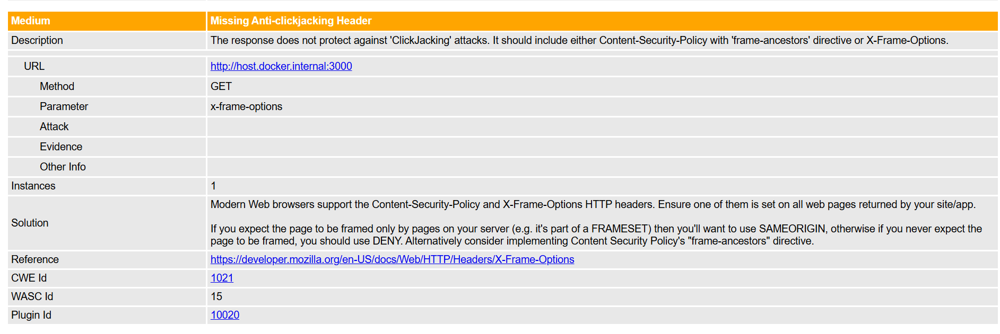
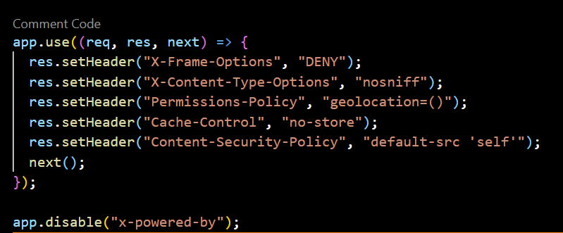

# 🔐 Secure Node.js App with OWASP ZAP CI/CD Integration

This project demonstrates a secure development lifecycle using a Node.js web application, integrated with OWASP ZAP for automated security testing in a CI/CD pipeline.

## 📚 Table of Contents
- [🚀 Project Overview](#-project-overview)
- [🧪 ZAP Security Scan Summary](#-zap-security-scan-summary)
- [📂 Screenshots](#-screenshots)
- [📄 Full Scan Report](#-full-scan-report)
- [📌 How to Run Locally with Docker](#-how-to-run-locally-with-docker)
- [📘 References](#-references)
- [🛡️ License](#-license)

## 🚀 Project Overview

- **Stack**: Node.js, Express.js  
- **Security Tool**: OWASP ZAP (Docker-based scan)  
- **CI/CD**: GitHub Actions  
- **Containerization**: Docker (ZAP scan run locally via Docker)

## 🧪 ZAP Security Scan Summary

- **Scan Date**: 2025-06-18  
- **Target**: http://localhost:3000  
- ✅ 58 Security checks passed  
- ⚠️ 8 Warnings (non-critical)  
- ❌ 0 Critical issues

> The ZAP scan was performed using a Docker container running the official OWASP ZAP baseline scan tool.

### 📋 Key Security Fixes Implemented

| Issue                             | Risk          | Resolution |
|----------------------------------|---------------|------------|
| X-Content-Type-Options Missing   | MIME sniffing | `nosniff` header added |
| X-Powered-By Leaks Info          | Info leak     | `app.disable('x-powered-by')` |
| Anti-Clickjacking Header Missing | Clickjacking  | `X-Frame-Options: DENY` |
| Content Security Policy Missing  | XSS risk      | Basic CSP added |
| Permissions Policy Header Missing| Feature abuse | Permissions header added |

## 📂 Screenshots

### 🔸 ZAP Alerts Summary

### 🔸 Example Warning: Anti-clickjacking Header

### 🔸 Fix: Security Headers in Code

## 📄 Full Scan Report

View the full HTML scan report here: [zap-report.html](./zap-report.html)

## 📌 How to Run Locally with Docker

Follow these steps to run the app and scan it using OWASP ZAP in Docker:

### 1. Start the Node.js App

    git clone https://github.com/shaaronn/Secure-Node-App.git
    cd Secure-Node-App
    npm install
    npm start

Make sure the app is running at http://localhost:3000.

### 2. In a New Terminal, Run the ZAP Scan via Docker

    docker run -v "$PWD:/zap/wrk/:rw" -t ghcr.io/zaproxy/zaproxy:stable \
    zap-baseline.py -t http://host.docker.internal:3000 -r zap-report.html

This will:

- Pull the latest OWASP ZAP image
- Scan your running app
- Generate zap-report.html with detailed security findings

📘 References
- [OWASP ZAP Project](https://www.zaproxy.org/)
- [OWASP ZAP GitHub Action](https://github.com/zaproxy/action-baseline)
- [OWASP Secure Headers Guide](https://owasp.org/www-project-secure-headers/)
- [GitHub Actions Documentation](https://docs.github.com/en/actions)

